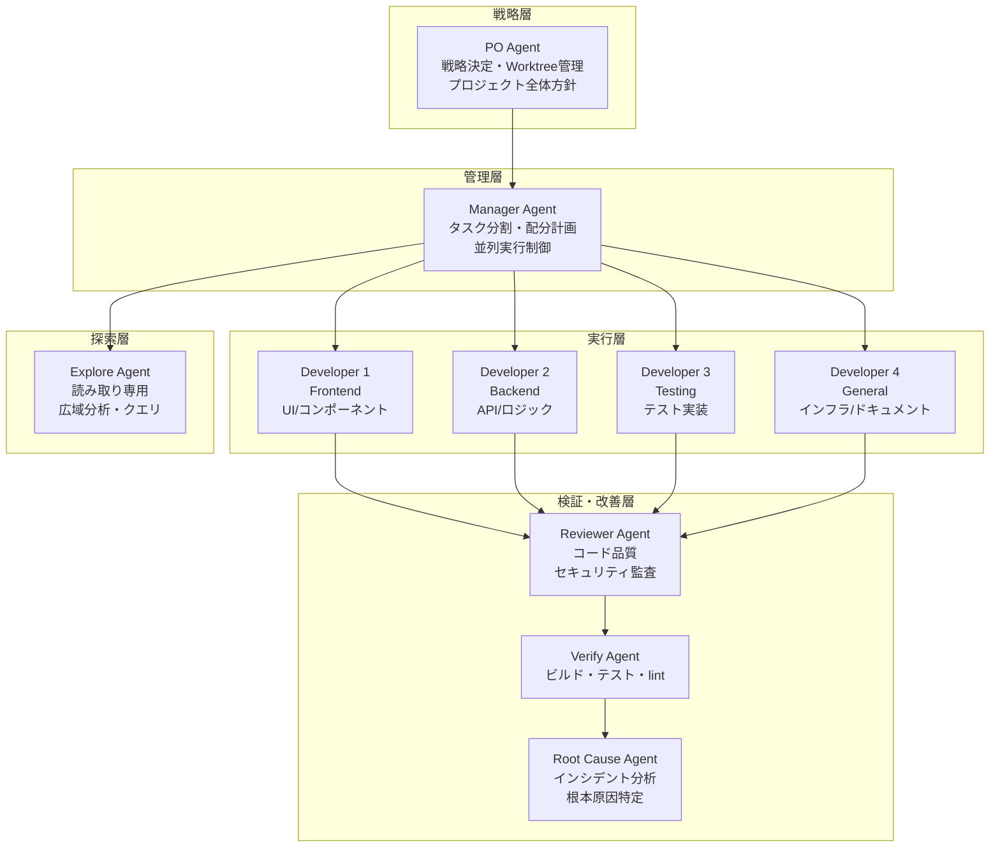
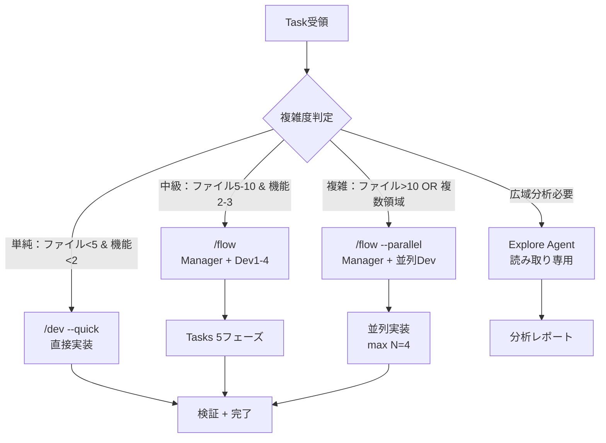
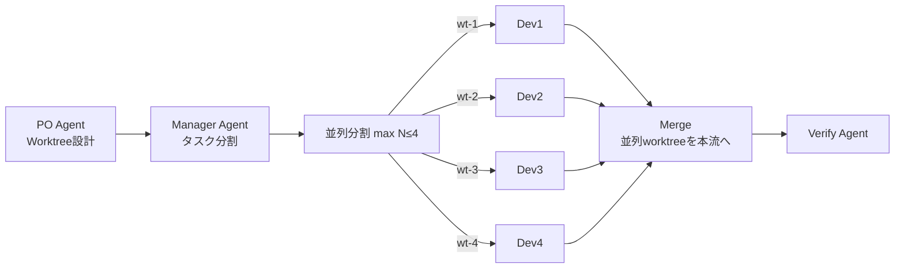

# Agent Flowchart - エージェント連携フロー図

> 7段階エージェント階層による自動化フロー

## エージェント階層構造



## タスク複雑度による Agent 選択



## Developer 専門性分類（実行層 N=4）

| ID | 専門 | 担当 | 例 |
|----|------|------|-----|
| dev1 | Frontend | UI/UX、コンポーネント | React/Vue/Svelte |
| dev2 | Backend | API、ビジネスロジック | Node.js/Python/Go |
| dev3 | Testing | テスト実装、品質保証 | Jest/pytest/RSpec |
| dev4 | General | インフラ、ドキュメント | Docker/K8s/Terraform |

## 並列実行フロー（`/flow --parallel`）



## ワークフロー入力点

| コマンド | 実行Agent | 用途 |
|---------|-----------|------|
| `/plan` | PO | 戦略計画・DesignDoc |
| `/flow` | Manager | タスク分割・単順行 |
| `/flow --parallel` | Manager | 並列実行制御（N≤4） |
| `/dev` | Developer | 直接実装（単発） |
| `/dev --quick` | Developer | 軽量実装（1-2ファイル） |
| `/explore` | Explore | 広域読み取り分析 |
| `/review` | Reviewer | コード品質・セキュリティ |
| `/root-cause` | Root Cause | インシデント分析 |
| `/verify-once` | Verify | 検証用テスト |

## 完了フロー

```
Developer実装完了
  ↓
Reviewer コード品質監査
  ↓
Verify Agent テスト・lint・ビルド
  ↓
Root Cause Agent 潜在リスク検査
  ↓
成功 → PR / merge
失敗 → bug report + Developer再実装
```
