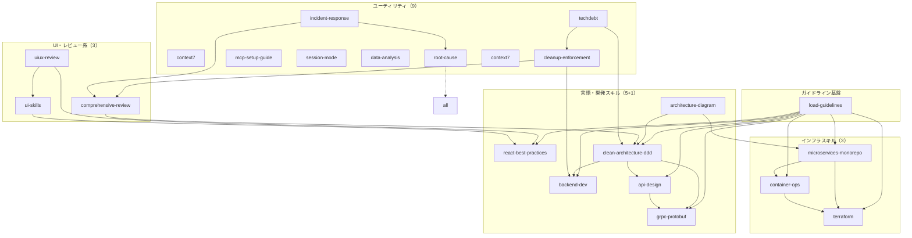
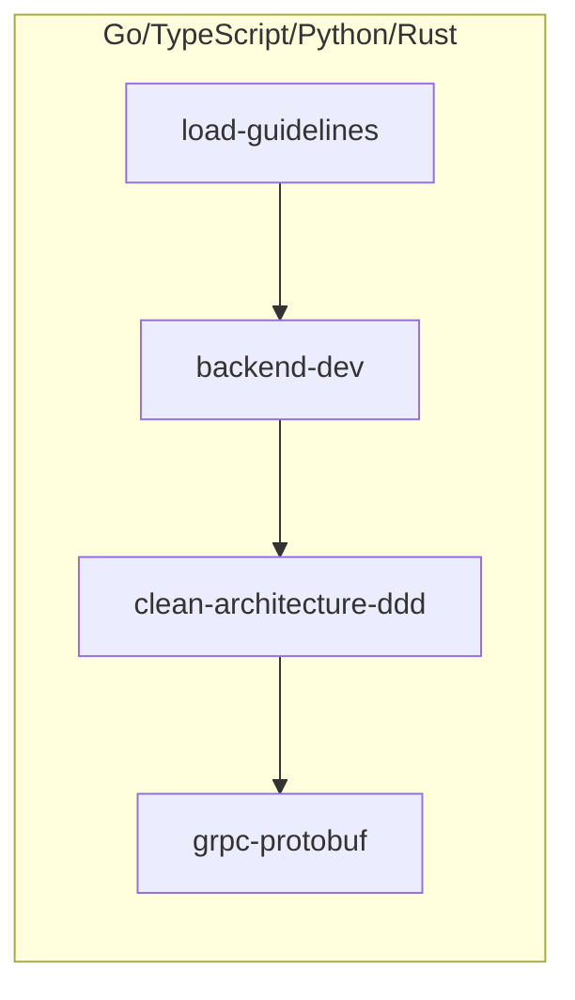
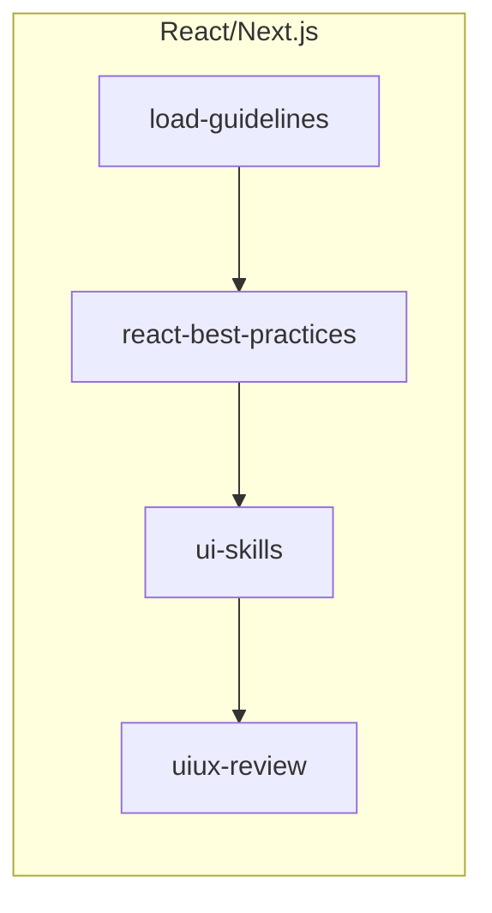
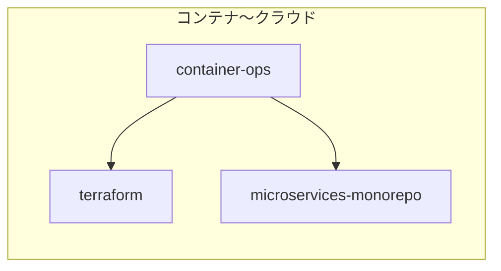
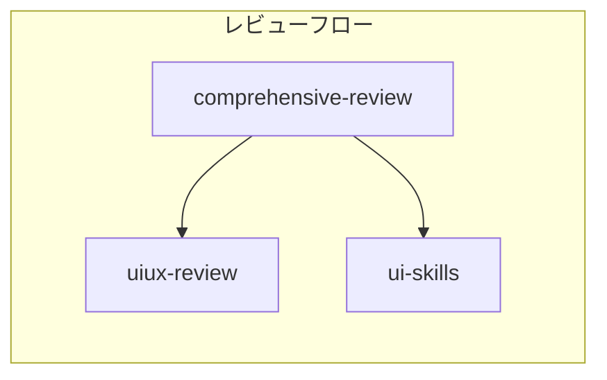
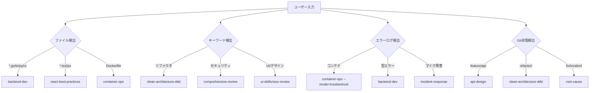

# Skills Dependency Graph - スキル依存関係図

> スキル間の依存関係と推奨組み合わせを可視化

**注記**: Phase 2-5でスキル統合を実施（24スキル→21スキル）。本ドキュメントは新スキル名で更新済み。旧スキル名も動作します。詳細は [SKILL-MIGRATION.md](../tutorials/SKILL-MIGRATION.md) 参照。

## スキル依存関係全体図

## カテゴリ別依存関係

### バックエンド開発

### フロントエンド開発

### インフラ構築

### 品質レビュー

## 推奨スキル組み合わせ

### フルスタック開発

| 用途 | スキル組み合わせ |
|------|-----------------|
| **バックエンド（Go/TS/Python/Rust）** | `backend-dev` → `clean-architecture-ddd` → `api-design` / `grpc-protobuf` |
| **マイクロサービス** | `backend-dev` + `clean-architecture-ddd` + `microservices-monorepo` → `api-design` |
| **React/Next.js** | `react-best-practices` → `ui-skills` → `uiux-review` |
| **設計重視** | `clean-architecture-ddd` → `architecture-diagram` |

### インフラ構築

| 用途 | スキル組み合わせ |
|------|-----------------|
| **コンテナ化** | `container-ops` |
| **Kubernetes デプロイ** | `container-ops` → `microservices-monorepo` |
| **クラウド全体** | `container-ops` → `terraform` |
| **コンテナトラブル** | `container-ops --mode=troubleshoot` |

### 品質保証

| 用途 | スキル組み合わせ |
|------|-----------------|
| **コード品質** | `comprehensive-review` |
| **セキュリティ＆品質** | `comprehensive-review` + `root-cause` |
| **インシデント対応** | `incident-response` → `root-cause` |
| **UI/UX** | `uiux-review` → `ui-skills` |

## スキル自動選択フロー

## 優先度ルール

1. **エラー検出** → 最優先（問題解決）
2. **ファイルパス検出** → 高優先（言語特定）
3. **キーワード検出** → 中優先（意図理解）
4. **Git状態検出** → 低優先（コンテキスト補完）

## ガイドライン必須スキル

以下のスキルは `load-guidelines` の事前読み込みが必須:

| スキル | 必要ガイドライン |
|--------|-----------------|
| `backend-dev` | `languages/golang.md`, `languages/typescript.md`, `languages/python.md`, `languages/rust.md`（言語検出時） |
| `react-best-practices` | `languages/react-best-practices.md` |
| `clean-architecture-ddd` | `design/clean-architecture-ddd.md` |
| `api-design` | `design/api-design.md` |
| `grpc-protobuf` | `languages/golang.md`, `design/grpc-protobuf.md` |
| `container-ops` | `infrastructure/docker-kubernetes.md` |
| `terraform` | `infrastructure/terraform.md` |
| `microservices-monorepo` | `infrastructure/microservices-kubernetes.md` |
| `comprehensive-review` | `common/review-guidelines.md` |
