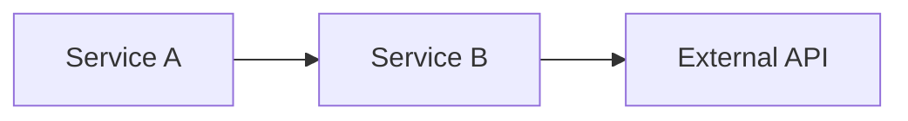

# /prd - 要件定義・PRD作成コマンド

## 目的

複雑な要件（マイクロサービス連携、外部API考慮）を整理し、あらゆる角度から抜け漏れを検出する。

## 実行フロー

### Phase 1: 情報収集（対話式）

AskUserQuestion を使用して段階的に情報を収集する。

**Step 1: 概要**
```
質問: 何を実現したいですか？
- 目的・背景
- 解決したい課題
```

**Step 2: 関連サービス**
```
質問: どのサービスが関係しますか？（複数選択可）
- 既存サービス一覧を提示
- 新規サービス追加も可
- 各サービスの役割を確認
```

**Step 3: 外部API・依存**
```
質問: 外部APIや外部サービスはありますか？
- API仕様URL → WebFetchで自動取得・要約
- 制約（レート制限、タイムアウト等）を抽出
```

**Step 4: ユーザー・権限**
```
質問: 誰が使いますか？権限は？
- ユーザーロール
- 権限マトリクス
```

**Step 5: 主要フロー**
```
質問: メインの処理フローは？
- 正常系フロー
- 入力・出力
```

### Phase 2: PRD自動生成

収集情報から以下を自動構築:

```markdown
# PRD: [機能名]

## 1. 概要
- 目的:
- 背景:
- スコープ: In / Out

## 2. ユーザーストーリー
- [ロール]として、[行動]したい。なぜなら[理由]。

## 3. サービス依存関係


## 4. 外部API仕様
| API | エンドポイント | 制約 |
|-----|---------------|------|
| Payment | POST /charge | 3秒タイムアウト |

## 5. 変数マトリクス
| 変数 | 型 | 発生元 | 影響先 | 必須 | 制約 |
|------|---|--------|--------|------|------|

## 6. 状態遷移
| 現状態 | イベント | 次状態 | 備考 |
|--------|---------|--------|------|

## 7. 受け入れ基準
- [ ] 基準1
- [ ] 基準2
```

### Phase 3: 多角的レビュー（10ペルソナ）

PRD生成後、以下の専門家視点で自動レビューを実行。

#### レビュアー定義

| ID | ペルソナ | 観点 | チェック項目 |
|----|---------|------|-------------|
| SEC | セキュリティエンジニア | 認証・認可・データ保護 | 認証なしAPI、個人情報露出、インジェクション、暗号化 |
| PERF | パフォーマンスエンジニア | 速度・スケール | N+1、ボトルネック、キャッシュ、同時実行数 |
| SRE | SRE/運用 | 可用性・監視・復旧 | SPOF、障害検知、ロールバック、アラート |
| QA | QAエンジニア | テスト可能性 | エッジケース、0件/大量件、境界値、再現性 |
| UX | UXデザイナー | ユーザー体験 | エラー表示、待機UI、導線、アクセシビリティ |
| DATA | データエンジニア | データ整合性 | 履歴、監査ログ、整合性、マイグレーション |
| BIZ | プロダクトオーナー | ビジネス価値 | ROI、優先度、MVP、本当に必要か |
| LEGAL | 法務/コンプライアンス | 規制・規約 | 個人情報、保持期間、同意、規約 |
| ARCH | アーキテクト | 設計・拡張性 | 依存関係、技術的負債、拡張性、一貫性 |
| EXT | 外部連携スペシャリスト | API連携 | 障害時フォールバック、リトライ、レート制限 |

#### レビュー手法

**1. 論理検証（MECE）**
```
全状態 = 状態A ∪ 状態B ∪ 状態C
状態A ∩ 状態B = ∅
→ 漏れ・重複を検出
```

**2. 状態遷移の完全性**
```
全ての (状態 × イベント) に対して次状態が定義されているか
```

**3. 条件分岐の網羅（デシジョンテーブル）**
```
全ての条件組み合わせに結果が定義されているか
```

**4. 矛盾検出**
```
ルール間の論理的矛盾がないか
```

**5. 反証質問**
```
- 〜でない場合は？
- 〜が失敗したら？
- 同時に〜したら？
- 0件/100万件だったら？
- 悪意あるユーザーなら？
```

### Phase 4: 指摘一覧の出力

重要度で分類して提示:

```markdown
## レビュー結果

### ❌ Critical（必須対応）
対応しないとリリース不可

1. [SEC] カード情報の暗号化方式が未定義
2. [ARCH] Payment Service障害時、Order Serviceがハング
3. [LEGAL] 個人情報の保持期間が未定義

### ⚠️ Warning（推奨対応）
リスクあり、対応推奨

4. [PERF] 同時100決済でDBロック競合の可能性
5. [SRE] 決済エラーのアラート閾値が未設定
6. [EXT] 外部API障害時のフォールバック未定義

### 💡 Info（検討推奨）
改善の余地あり

7. [UX] 決済処理中の待機UIが未定義
8. [DATA] 決済履歴の保持期間は？
9. [QA] 金額0円のテストケースは？
```

### Phase 5: 修正・承認

```
AskUserQuestion:
- 指摘を修正してPRD更新
- 一部承認して次へ進む
- /plan で実装計画へ
- /dev で実装開始
```

## 出力テンプレート

最終PRDは以下の形式:

```markdown
# PRD: [機能名]
作成日: YYYY-MM-DD
ステータス: Draft / Reviewed / Approved

## 1. 概要
### 1.1 目的
### 1.2 背景・課題
### 1.3 スコープ
- In:
- Out:

## 2. ユーザー
### 2.1 ターゲットユーザー
### 2.2 ユーザーストーリー
### 2.3 権限マトリクス

## 3. システム構成
### 3.1 サービス依存関係（図）
### 3.2 データフロー
### 3.3 外部API仕様

## 4. 機能要件
### 4.1 変数マトリクス
### 4.2 状態遷移
### 4.3 ビジネスルール

## 5. 非機能要件
### 5.1 パフォーマンス
### 5.2 セキュリティ
### 5.3 可用性
### 5.4 監視・運用

## 6. 受け入れ基準
- [ ] 基準1
- [ ] 基準2

## 7. レビュー結果
### 7.1 Critical（対応済み）
### 7.2 Warning（対応済み/許容）
### 7.3 Info（検討結果）

## 8. 次のアクション
- [ ] /plan で実装計画
- [ ] /dev で実装開始
```

## 注意事項

- **読み取り専用**: このコマンドでは実装しない
- **外部API**: WebFetchで仕様取得可能
- **Jira/Confluence連携**: 既存チケット・ドキュメント参照可能
- **反復可能**: 指摘→修正→再レビューを繰り返せる
