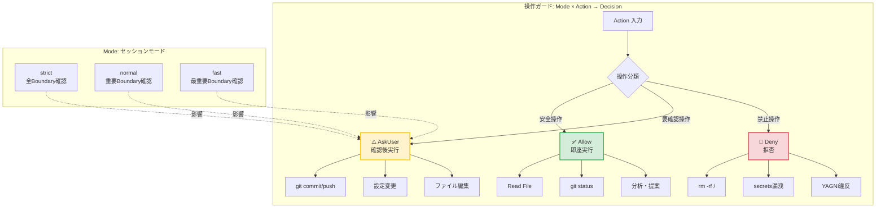
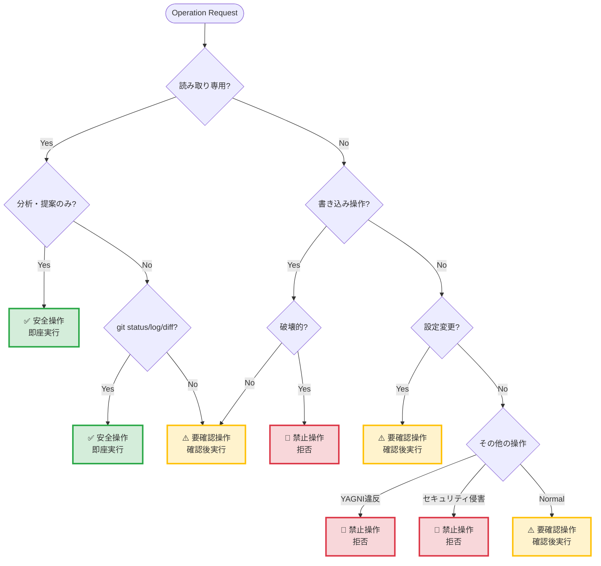

## /protection-mode - Protection Mode（操作保護モード）

## 実行ロジック

### Step 1: Serena memory確認

```
mcp__serena__read_memory("protection-mode-loaded")
```

- **存在する場合**: memoryから要約を読み込み、ファイル読み込みをスキップ
- **存在しない場合**: ファイルを読み込み、memoryに保存

### Step 2: 初回のみファイル読み込み

| 引数 | 読み込むファイル |
|------|-----------------|
| (なし) | skill.md, guardrails.md |
| `full` | skill.md, guardrails.md, session-modes.md |

ファイルパス:
- `~/.claude/skills/session-mode/skill.md`
- `~/.claude/guidelines/common/guardrails.md`
- `~/.claude/guidelines/common/session-modes.md`（fullのみ）

### Step 3: memoryに保存（初回のみ）

```
mcp__serena__write_memory("protection-mode-loaded", {
  loaded_at: ISO8601,
  summary: "操作ガード・3層分類適用済み"
})
```

### Step 4: 適用報告

```
## Protection Modeを適用

現在の制約:
- 安全操作: 自動許可（読み取り、分析、提案）
- 要確認操作: 確認必要（git操作、設定変更）
- 禁止操作: 拒否（システム破壊、セキュリティ侵害）
```

---

## 3層分類クイックリファレンス

| 層 | 処理 | 例 |
|---|------|---|
| **Safe** | 即座実行 | ファイル読み取り, git status |
| **Boundary** | 確認後実行 | git commit/push, 設定変更 |
| **Forbidden** | 拒否 | rm -rf /, secrets漏洩 |

### 3層分類の可視化



### 操作分類の判定フロー



---

## 操作ガード

```
operationGuard : Mode × Action → {Allow, AskUser, Deny}
```

**数学的定義**:
- `operationGuard(strict, Boundary) = AskUser` （全Boundary確認）
- `operationGuard(normal, Boundary) = AskUser` （重要Boundary確認）
- `operationGuard(fast, Boundary) = AskUser | Allow` （最重要Boundaryのみ確認）
- `operationGuard(_, Safe) = Allow` （モード不問で許可）
- `operationGuard(_, Forbidden) = Deny` （モード不問で拒否）

---

## 複雑度判定（タスク判定）

```
ComplexityCheck : UserRequest → {Simple, TaskDecomposition, AgentHierarchy}
```

### 判定基準

| 条件 | 判定 | アクション |
|------|------|-----------|
| ファイル数<5 AND 行数<300 | **Simple** | 直接実装 |
| ファイル数≥5 OR 独立機能≥3 OR 行数≥300 | **TaskDecomposition** | 5フェーズワークフロー |
| 複数プロジェクト横断 OR 戦略的判断 | **AgentHierarchy** | PO/Manager/Developer |

### 5フェーズワークフロー（TaskDecomposition時）

| Phase | 目的 | 不変条件（違反時は次フェーズ不可） |
|-------|------|----------------------------------|
| 0 | 要求分析 | 必須要件に説明・受け入れ条件あり |
| 1 | タスク分解 | カバレッジ = 100% |
| 2 | ファイル作成 | トレーサビリティ完全 |
| 3 | 依存整理 | 循環依存なし |
| 4 | Agent起動 | 全タスク成功完了 |
| 5 | 統合検証 | 未実装要件 = ∅ |

**詳細**: `claude-code/references/AI-THINKING-ESSENTIALS.md` 参照

---

## 品質ガード（実装品質チェック）

```
GuardQuality : Implementation → {Accept, ReviewRequired, Reject}
```

対症療法パターンを検出し、構造的な修正を推奨します。

### 検出パターン

#### Reject（自動拒否）

```typescript
// Pattern 1: 理由なきnull check
if (user === null) return;  // なぜnullなのか？

// Pattern 2: エラー握りつぶし
try {
  dangerousOperation();
} catch {
  /* ignore */
}  // なぜ失敗するのか？

// Pattern 3: 根拠なきタイムアウト増加
setTimeout(() => fetch(), 10000);  // なぜ10秒必要か？
```

#### ReviewRequired（要レビュー）

```typescript
// 正当化されたworkaround
// Root cause: 外部API不安定（documented）
const retryWithBackoff = ...;  // レビュー推奨

// TODO付き暫定対応
// TODO: [RCA-123] Remove after upstream fix
const temporaryFix = ...;  // レビュー推奨
```

#### Accept（許可）

```typescript
// 構造的修正
class User {
  constructor(name: string) {
    this.name = name;  // 初期化保証
  }
}

// 境界での検証
function createUser(data: unknown): User {
  const validated = UserSchema.parse(data);  // 型安全
  return new User(validated.name);
}
```

### 操作ガードとの統合

```
operationGuard → 品質ガード : Mode × Implementation → Decision

フロー:
  Implementation → GuardQuality → {Accept, ReviewRequired, Reject}
                                         ↓
                                    operationGuard（Mode考慮）
                                         ↓
                              {Allow, AskUser, Deny}
```

**モード別の動作**:
- `strict`: ReviewRequired → 必ず確認
- `normal`: ReviewRequired → 警告表示（デフォルト）
- `fast`: ReviewRequired → ログ記録のみ

**大規模作業向け**: `guidelines/common/large-scale-workflow.md` 参照
- 10ファイル以上、500行以上、60分以上の作業に適用
- Phase 0-5の詳細ワークフロー、チェックポイント、並列実行戦略

---

ARGUMENTS: $ARGUMENTS
