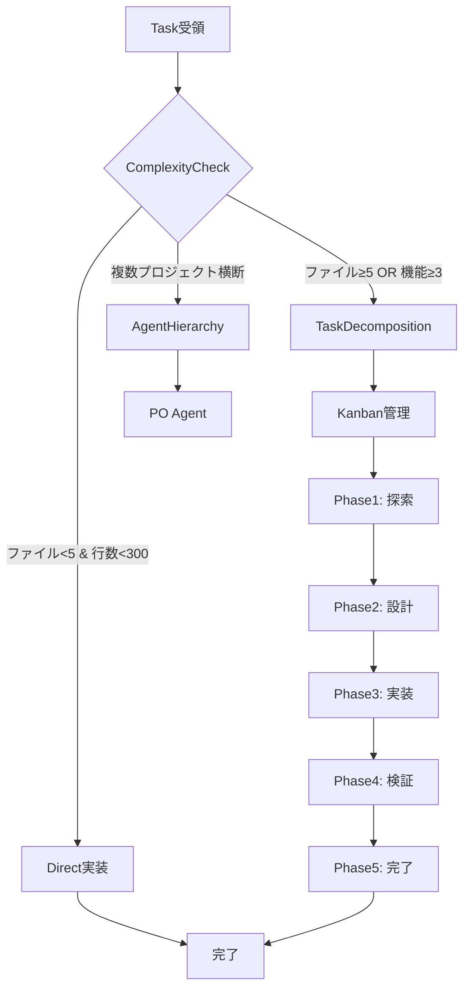
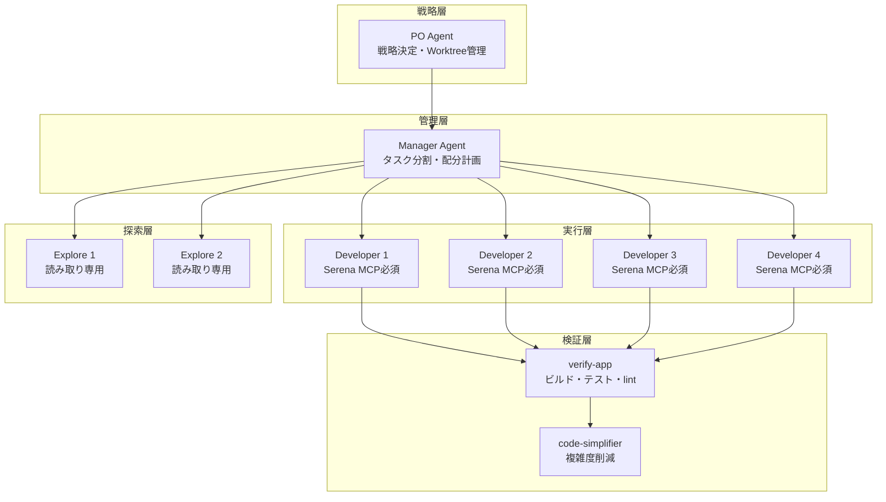
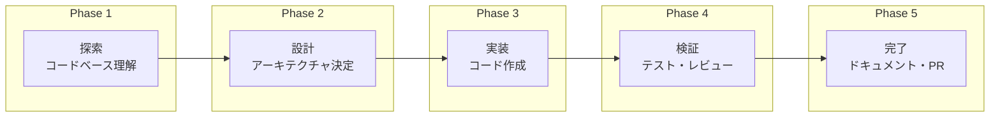
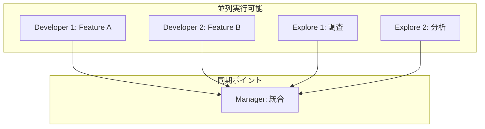

# Agent Flowchart - エージェント連携フロー図

> タスク複雑度に応じた適切なエージェント連携パターン

## ComplexityCheck 判定フロー



## エージェント階層構造



## ワークフロー自動化

```mermaid
flowchart LR
    subgraph "入力"
        User[ユーザー入力]
        Flow[/flow コマンド]
    end

    subgraph "判定"
        WO[workflow-orchestrator]
        Type{タスクタイプ}
    end

    subgraph "実行"
        Plan[/plan]
        Dev[/dev]
        Review[/review]
        Debug[/debug]
        Test[/test]
    end

    User --> Flow
    Flow --> WO
    WO --> Type

    Type -->|"設計・計画"| Plan
    Type -->|"実装"| Dev
    Type -->|"レビュー"| Review
    Type -->|"デバッグ"| Debug
    Type -->|"テスト作成"| Test
```

## Kanban 5フェーズ



## エージェント特性一覧

| エージェント | 役割 | ツール | 特徴 |
|-------------|------|--------|------|
| **po-agent** | 戦略決定 | All tools | 実装は一切行わない |
| **manager-agent** | タスク分割 | All tools | 実装は一切行わない |
| **developer-agent** | 実装担当 | All tools + Serena MCP | Serena必須 |
| **explore-agent** | 探索・分析 | All tools + Serena MCP | 読み取り専用 |
| **verify-app** | 包括検証 | All tools | ビルド・テスト・lint |
| **code-simplifier** | 簡素化 | All tools | 複雑度削減・重複統合 |
| **workflow-orchestrator** | 自動化 | All tools | タスクタイプ判定 |

## 並列実行パターン



## 使用例

### Simple タスク
```
ユーザー: "この関数のバグを修正して"
→ 直接実装（エージェント不要）
```

### TaskDecomposition タスク
```
ユーザー: "ユーザー認証機能を追加して"
→ Kanban + 5フェーズで管理
→ Developer 1-2 が並列実装
```

### AgentHierarchy タスク
```
ユーザー: "フロントエンドとバックエンドを新規構築"
→ PO が戦略決定
→ Manager がタスク分割
→ Developer 1-4 が並列実装
→ verify-app で検証
```
