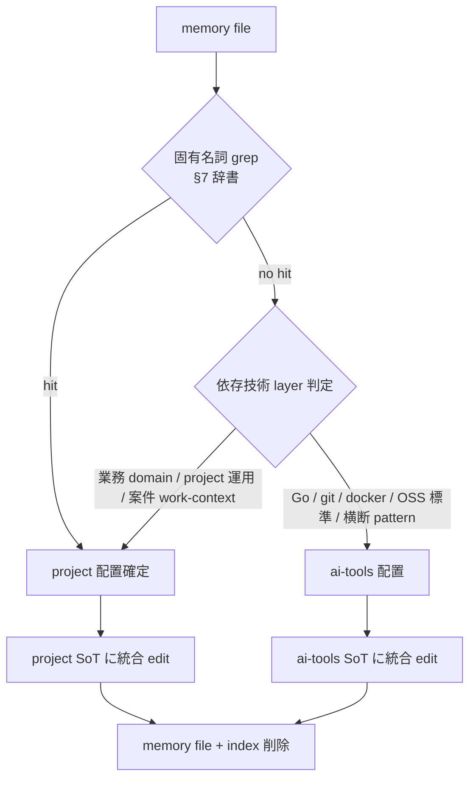
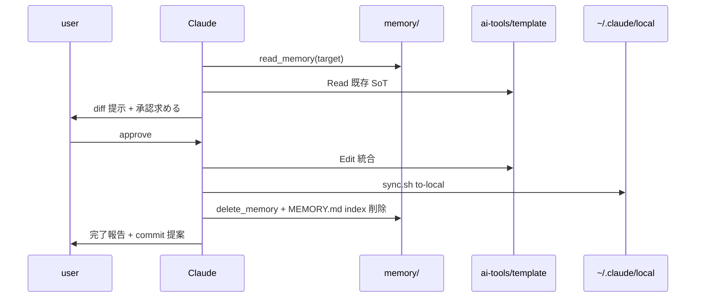

# memory → CLAUDE.md / ai-tools 昇格 flow

memory に貯めた knowledge を CLAUDE.md / ai-tools skill / command へ昇格させる運用 flow。汎用 / project 固有の振り分け基準と SoT 集約手順を定義する。

- **Type**: arch (基盤・運用 flow)
- **Source PRD**: 2026-05-29 chat session (memory ナレッジ昇格 PRD)
- **補完関係**: [`memory-usage.md`](memory-usage.md) は memory の使い分け基礎、本 doc は昇格 flow に特化

## 1. 背景・課題

| 観点 | 現状 | 課題 |
|------|------|------|
| MEMORY.md sizing | 38 entry / 8KB (snkrdunk project) | 200 行で truncate、増え続けると古い entry が見えなくなる |
| SoT 重複 | project CLAUDE.md と memory 両方に同内容存在 (例: `feedback_code_comment_why_or_memo` ↔ snkrdunk/CLAUDE.md) | 更新時に desync、どちらが SoT か不明 |
| 汎用 knowledge 埋没 | 他 project でも有効な knowledge が特定 project の memory に閉じる | 他 project session で再発見が必要、cost 重複 |
| 昇格 timing | 明示 trigger なし、user 気付き依存 | 形骸化、memory が garbage 化 |

**measured data** (`~/.claude/CLAUDE.md` 既載):

- Agent 起動 cost = 数十秒〜501s (最大、`general-purpose` agent)
- skill / command target = 100-150 行
- cache_read = 96.8% (token cost の主因)
- MEMORY.md = 常時 inject、200 行 truncate

## 2. Goal / Non-goal

| | 内容 |
|---|------|
| **Goal** | (1) session 起動 cost 最小化 (MEMORY.md 50 行以下維持) (2) SoT 集約 (knowledge 1 箇所のみ) (3) 汎用 knowledge を他 project でも再利用可能化 |
| **Non-goal** | memory への新規書き込み制御 (`/memory-save` skill の責務) / project 横断の自動 sync / 完全自動昇格 (user 確認必須) |

## 1.5 Decision Rationale (Q1-Q5)

> Source: 2026-05-29 PRD chat 出力。設計段階での差分のみ追記。

| Q | 結論 (PRD inherit) | 設計差分 |
|---|--------------------|---------|
| Q1 真の goal | session 起動 cost 削減 + SoT 集約 + 汎用 knowledge 再利用 | — |
| Q2 build nothing 比較 | 現状放置 NG (MEMORY.md truncate / 重複放置 / 陳腐化) | — |
| Q3 alternatives | A. 推奨基準 + user 確認 (採用) / B. user 明示のみ / C. 完全自動 retrospective | **設計差分**: A を hook 提示 + `/promote` command の 2 経路でカバー (user 確認は維持) |
| Q4 premortems | 誤昇格 (固有名詞汚染) / 判断 cost 超過 / symlink 切れ | **設計差分**: symlink 採用回避決定 (PRD review で確定)、stub 1 行 comment で代替 |
| Q5 assumption 破綻 | memory 50+ / project 増 / 汎用 knowledge の project 固有変質 | **設計差分**: 逆方向 demote (ai-tools → project) は本 flow scope 外、別 doc 化 |

## 3. 設計選択肢比較 (trigger 検知方式)

| 案 | 概要 | pros | cons | 採否 |
|----|------|------|------|------|
| A. session 開始 hook 単独 | SessionStart hook で MEMORY.md scan、閾値超で提示 | 完全自動、忘れない | settings.json 編集必要、誤検知 spam risk | ❌ |
| B. `/promote` command 単独 | user 明示起動、ref doc 参照しながら判定 | YAGNI、hook 不要 | trigger 忘れで形骸化 | ❌ |
| **C. hook + command 併用 (採用)** | hook で session 開始時 1 回提示、`/promote` で都度手動実行 | 自動 reminder + user control | 初期 cost 高 | ✅ |

採用根拠: PRD Q4 premortem「判断 cost 超過で形骸化」回避には reminder 必要。hook 提示は 1 session 1 回に絞り spam 回避、実行は `/promote` で確実な user 確認 step を経由。

## 4. 振り分け logic

**境界曖昧 case**: symlink **採用しない** (PRD review で確定、ai-tools 移動で切れる risk)。原則 ai-tools 配置 + project CLAUDE.md に 1 行 reference (`参照: ai-tools/claude-code/<path>`) を残す。

## 5. type × scope 配置 matrix

| memory type | 汎用 (ai-tools) 配置先 | project 固有 配置先 |
|-------------|----------------------|------------------|
| feedback (rule) | `~/ai-tools/claude-code/rules/<topic>.md` | project `CLAUDE.md` 該当 section / `<repo>/.claude/rules/<topic>.md` |
| reference (location) | `~/ai-tools/claude-code/references/<topic>.md` | project `CLAUDE.md` "## ナレッジ保存先" |
| 操作 pattern / workflow | `~/ai-tools/claude-code/skills/<name>.md` | `<repo>/.claude/workflows/<name>.md` |
| 自動化 command | `~/ai-tools/claude-code/commands/<name>.md` | `<repo>/.claude/commands/<name>.md` |
| project / work-context | (該当なし、汎用化不可) | 案件完了で削除 / project CLAUDE.md 反映 |

## 5.1 既存 SoT 統合手順 (DATA Critical 対応)

ai-tools / project CLAUDE.md への昇格は **既存 file 上書き risk あり**。下記 step 必須:

1. **Read 必須**: 配置先 file 全文 Read (新規 write は `Read` 不要だが既存 edit は Read 前提)
2. **diff 提示**: user に統合 diff (どの section に何を追加するか) を提示、承認待ち
3. **Edit 適用**: 承認後 `Edit` で原子的に統合
4. **sync.sh 実行 (ai-tools のみ)**: `~/ai-tools/claude-code/sync.sh to-local` で `~/.claude/` に反映 (CLAUDE.md "Editing Rule" 準拠、local 直編集 wipe 対策)
5. **memory 削除**: 配置先 commit 後に memory file + MEMORY.md index 同時削除

## 6. trigger 推奨基準 (運用閾値)

| trigger | 閾値 | 根拠 | 提示経路 |
|---------|------|------|----------|
| **A. MEMORY.md 行数** | 50 行超 | 200 行 truncate の 25%、cache 効率 balance | session 開始 hook |
| **B. 同 topic file 数** | 3 file 以上 | 集約で skill 1 file (100-150 行) に収まる粒度、SoT 効果定量化可能 (**最強 trigger**) | hook + `/promote` |
| **C. 横断参照頻度** | 同 file を 3 session 以上 reference | 高頻度 = SoT 昇格価値あり | `/promote` 手動 |
| **D. file 単体サイズ** | 5KB / 150 行超 | skill target 超え、独立 skill 化候補 | hook 警告 |
| **E. user 明示** | `/promote <file>` | 都度判定 | command 直接 |

## 7. snkrdunk 固有名詞辞書 (grep target)

下記 1 単語でも hit したら project 配置確定。

| カテゴリ | 単語 |
|---------|------|
| bounded context / domain | `bounded_context` / `draw_slots` / `oripa` / `snkrdunk` |
| インフラ識別子 | `valkey-*` / `migrate-up` / `redis-test` (port 6384) |
| PR / Issue 番号 | `#30474` / `#34xxx` / `#35xxx` (実 issue 番号 hit で固有判定) |
| 外部 SoT 場所 | `snkrdunk/docs` / `local-docs` / Notion DB ID `00d39843-f019-4528-b055-2ef20b2fe059` |
| 運用名詞 | `bastion` / `dev リハーサル` / `Phase A` / `Phase B` (chain PR 文脈) |

**他 project 追加時**: 本 §7 に project section 追記 (e.g. `## 7.2 loadtest 固有名詞`)、本 doc を SoT として一元管理する (user 決定: 単一 file 集約)。

## 8. failure mode

| failure | 影響 | 対策 |
|---------|------|------|
| 誤昇格 (project 固有を ai-tools 化) | 他 project session で無関係 context 汚染 | §7 辞書 grep 必須、hit 時 user 確認 block |
| 統合 edit で既存 SoT 上書き | CLAUDE.md / skill 破壊 | §5.1 Read + diff 提示 + 承認 step 厳守 |
| ai-tools 配置後 local 反映漏れ | session で knowledge 効かない | `sync.sh to-local` 自動実行、CI で sync 確認 |
| memory 削除後に昇格先で typo / 内容欠落 | knowledge 喪失 | memory 削除は **昇格 commit 後**、commit revert 可能性確保 |
| 案件完了 work-context 放置 | MEMORY.md 肥大 | 案件 close 時 (`gh issue close` 等) に session 終了で削除提案 |

## 9. 移行戦略

Expand → Migrate → Contract 3-phase。

| Phase | 内容 | 期間目安 |
|-------|------|---------|
| Expand | 本 doc + `/promote` command / hook 整備 | 完了 (2026-05-29) |
| Migrate | `/promote` で trigger B (同 topic 3 file 以上) hit 順に昇格、user 都度承認 | 数 session 分散 |
| Contract | 全昇格完了後、MEMORY.md 50 行以下達成確認 | Migrate 完了時 |

**Migrate 進捗** (snkrdunk.com project の場合):

| topic | 状態 | 昇格先 |
|-------|------|--------|
| DesignDoc 書き方 (3-phase review / readability / iteration / writing style) | ✅ 完了 | `guidelines/writing/design-doc-protocol.md` + `PRINCIPLES.md` + `long-form-doc.md` |
| runbook 原則 (top-down / decision-binary / no reviewer assign) | ✅ 完了 | `guidelines/operations/runbook-writing.md` + `rules/ai-output.md` |
| local 環境 (valkey / oripa seed / test credentials / cluster recovery) | ⏸ 保留 | snkrdunk repo `CLAUDE.md` "## ローカル環境" 新設 (snkrdunk session で実施) |
| 本番切り戻し (rollback git revert) | ⏸ 保留 | snkrdunk repo `CLAUDE.md` (ECS/ecspresso 固有のため project 配置) |
| #30474 chain work-context | ⏸ 案件継続中 | 案件完了後一括削除 (汎用化不可) |

新規 project / 他 case では本表に topic 列を追加し進捗管理する。

## 10. open questions

- `/promote` command の引数 I/F: `<file>` 単独 / `--topic <name>` で複数集約 / `--all` で trigger B 全件 batch
- hook trigger 提示の頻度上限: session 開始 1 回 / 1 日 1 回 / 閾値変動時のみ
- 逆方向 demote (ai-tools → project) の判定 flow: 本 doc scope 外、別 doc

## 11. 関連 doc

- [`memory-usage.md`](memory-usage.md) — memory 使い分け基礎
- [`compounding-engineering-cycle.md`](compounding-engineering-cycle.md) — 非自明成功の記録 cycle
- `~/.claude/CLAUDE.md` "## Editing Rule" — ai-tools template / local 反映 rule
- `~/.claude/CLAUDE.md` "## auto memory" — memory type 定義と body 構造

---

## Next Steps

1. `/plan` で実装 phase 化 (`/promote` skill / hook 追加)
2. 暫定運用: 本 doc 参照しながら手動 `/promote` 相当を実施 (Migrate phase 先行可能)
