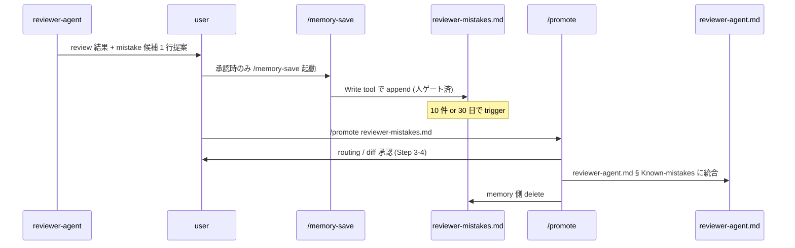

# Design Doc: reviewer-agent 誤 approve 記憶 loop (reviewer-mistakes buffer)

## 1. Overview

reviewer-agent が過去に見落とした P0/P1 defect (誤 approve) を蓄積する loop を導入する。蓄積先は `~/ai-tools/memory/reviewer-mistakes.md` (人ゲート経由)。一定件数溜まったら `/promote` で `agents/reviewer-agent.md` の prompt section に恒久昇格させる。目的は「LLM 判定 gate の誤答を次回 review 時に構造的に効かせる」こと。

PRD 相当は未作成 (今 turn の `/brainstorm` synthesis と `/design-doc` 会話が根拠)。前 phase doc 参照: なし。

## 2. Goals / Non-Goals

### Goals

- reviewer-agent の誤 approve (P0/P1 miss) を、user 承認を経て構造化 log として保存する
- 一定件数溜まった時点で `/promote` により reviewer-agent.md 本体に昇格し、以後の全 review で自動参照させる
- 昇格前後で reviewer-agent の判定挙動が変化した根拠を残す (どの mistake が rule 化された結果 P0 検出が増えたか)

### Non-Goals

- **AI による自動書き込み・自動昇格の一切**。全 write と全 promote は user 明示承認を経由する
- hook 層 (jp-quality-check.sh 等の決定論 gate) への適用。本 loop は agent 層 (reviewer-agent) 限定
- 誤 reject (冗長 finding) の収集。noise 増と "誤った確信の強化" を避けるため誤 approve のみを対象とする
- 他 agent (developer-agent / verify-app / design-review-agent) への横展開。効果測定後に別 doc で議論する
- 精度改善の quantitative 評価。撤退基準は含むが本 doc では実測 A/B 設計を行わない

## 3. Background

### Why (問題)

reviewer-agent は Generator-Verifier pattern の Verifier として P0-P3 finding を返す。判定の質は LLM 依存で、同種の誤 approve が session を跨いで再発する構造がある (実測は未取得、下記「未確認」)。現状これを止める仕組みは以下 2 つ:

- `agents/reviewer-agent.md` の prompt を人手で改訂 (Serena `find_symbol` + Edit)
- 個別 memory file (`feedback_reviewer_agent_*` 等) を書き、`/promote` で反映

いずれも「気付いた時にだけ」動く受動的 loop で、誤 approve を系統立てて蓄積・振り返る場所がない。

### 上流検討 (今 turn `/brainstorm --debate`)

対象 Zenn 記事 `https://zenn.dev/jodycraft/articles/dfe38e73e1ef8a` の「判定エンジニアリング」提案を proponent / skeptic で検証した。要点:

- **proponent**: Reflexion (Shinn et al. 2023, `https://arxiv.org/abs/2303.11366`) が「誤判定 → episodic memory → 次回 gate inject」構造を実証済み。HumanEval pass@1 を 80% → 91% に改善。骨格自体は work する
- **skeptic**: 自動昇格は AgentPoison (Chen et al. 2024, `https://arxiv.org/abs/2407.12784`) 系の poisoning 温床。Huang et al. 2023 (`https://arxiv.org/abs/2310.01798`) は「外部正解 signal なしの self-correction は推論性能を悪化させる」と報告。ai-tools 側は既に「Serena `write_memory` 全 project 禁止」「memory 恒久化前に Tier 判定」を敷いており、自動化は既定方針と衝突

本 doc は両者の一致点 (骨格は work する) を採る。加えて skeptic の警戒点 (自動昇格禁止 / 誤原因帰属対策 / 撤退基準) を制約として組み込む。

### 未確認事項

- reviewer-agent の誤 approve 実頻度 (log 未取得)。本 loop 導入後 30 日で計測する
- Reflexion の効果が LLM-as-Judge 領域でも同水準で出るかは論文範囲外

## 4. High-Level Design

### 全体構成

```mermaid
graph TB
    A[reviewer-agent review 完了] --> B{末尾に mistake 候補 1 行提案}
    B --> C{user 承認?}
    C -- no --> D[通常通り report 終了]
    C -- yes --> E[/memory-save で reviewer-mistakes.md に append]
    E --> F[buffer に蓄積]
    F --> G{promote trigger 到達?<br/>10 件 or 30 日}
    G -- no --> A
    G -- yes --> H[/promote reviewer-mistakes.md]
    H --> I{user が Step 3-4 承認?}
    I -- no --> F
    I -- yes --> J[reviewer-agent.md § Known-mistakes に昇格<br/>memory 側は削除]
    J --> A
```

### 責務境界

| 主体 | 責務 | 禁止事項 |
|---|---|---|
| reviewer-agent | review 完了時に「今回の approve は mistake 候補か」を自己申告 1 行提案する。write 権限なし (既存 `disallowedTools: Write/Edit/MultiEdit` 維持) | memory への直接書き込み / prompt 自己書き換え |
| user | 提案を採否判断。採なら `/memory-save` 起動、否ならそのまま turn 終了 | (制約なし) |
| /memory-save skill | `reviewer-mistakes.md` に append。Serena `write_memory` は使わず Write tool 経由 | Serena memory API 使用 |
| /promote command | Step 1-6 flow (既定通り)。Step 4 で reviewer-agent.md の `## Known mistakes` section に整形統合、Step 6 で memory 側を削除 | 自動 merge (Step 3-4 の user 承認必須) |
| reviewer-agent.md (昇格先) | 次回以降の全 review で prompt 内 `## Known mistakes` を自動参照 | (write 主体ではない) |

### data flow (書き込み〜昇格)



## 5. Detailed Design

### 5.1 data model (reviewer-mistakes.md 1 entry)

```markdown
## <YYYY-MM-DD>: <1 行 title>

- context: <どの PR / どの diff scope>
- 見落とした defect: <P0/P1 の実体、file:line>
- 当時の approve 理由 (agent 出力からの引用): <>
- 遡って発見した契機: <user 指摘 / verify-app failure / prod bug 等>
- 次回反映案: <どの review 観点を強化するか、1-2 行>
```

制約:

- 1 entry = markdown h2 セクション。50 行以内
- file 全体上限 = 20 entries (超過時は promote 発火 or 古い entry を user 判断で剪定)

### 5.2 interface (reviewer-agent 側の追加 prompt)

`agents/reviewer-agent.md` の `## Base flow` step 7 (Report) 直後に以下 1 節を追加する。

```markdown
## 8. Self mistake proposal (optional)

review が accept (P0/P1 findings なし) で終わる場合のみ、末尾に 1 行:

> **Mistake candidate?**: <今回の approve が誤 approve になり得る観点、なければ "none">

user が採否判断する。user が「memory-save で残して」と指示した場合のみ /memory-save が起動する。agent 自身は書き込まない。
```

`## Known mistakes` section も別途新設し (promote 昇格先)、初期値は空とする:

```markdown
## Known mistakes (auto-populated by /promote)

<!-- entries appended here from reviewer-mistakes.md via /promote Step 4 -->
```

### 5.3 処理 flow (promote step)

promote 発火時、既存 `commands/promote.md` Step 1-6 をそのまま利用し、Step 3 の destination を `agents/reviewer-agent.md` § `## Known mistakes` に固定する。追加 logic なし (既存 flow で完結)。

## 6. Alternatives

### Option A: memory buffer + /promote 昇格 (採用)

- **pros**: 既存 flow (`memory-save` → `promote`) をそのまま流用できる / 2 段の人ゲートが自然に入る / buffer の存在で「今すぐ本体を変えるほどか」の熟成期間を取れる
- **cons**: file が 1 つ増える / 昇格までのタイムラグ

### Option B: reviewer-agent.md に直接 `## Known-mistakes` を人手追記

- **pros**: pipeline が短く buffer 不要
- **cons**: mistake 発見の都度 SoT file を触るため diff が乱れる / 熟成期間なし / sync.sh 発火頻度が上がる
- **不採用理由**: 現状 reviewer-agent.md への高頻度 edit は Editing Rule で警戒対象。buffer 経由が既存慣習と整合する

### Option C: PR/issue の comment log を SoT、memory 化しない

- **pros**: file 増えない / 実データそのもの
- **cons**: 引き込み時に `gh` 呼び出しが必要 / signal 収集の人手が増える / repo 横断時に fetch scope が曖昧
- **不採用理由**: 引き込みコストが恒常的に効く。1 度 memory 化して構造化する方が prompt inject の再現性が高い

### Option D: 自動昇格 pipeline (記事原案)

- **pros**: 人の介在ゼロで loop 完結
- **cons**: AgentPoison / 誤原因帰属 / silent regression。ai-tools の既定方針 (Serena write_memory 全禁止 / memory 恒久化前に人ゲート必須) と正面衝突
- **不採用理由**: 上流 debate skeptic の 4 反論すべてに該当

## 7. Trade-offs

| 軸 | 得るもの | 失うもの |
|---|---|---|
| 精度 | 過去の誤 approve が次回に効く可能性 (Reflexion の類似構造で 80→91% 実績、ただし LLM-as-Judge 域は未確認) | agent 判定が prompt 肥大化で "Lost in the Middle" (Liu et al. 2023) に近づくリスク。20 entry 上限で緩和 |
| 運用コスト | 誤 approve の振り返り場所ができる | user が採否判断する turn が review 毎に発生 (candidate 提案 1 行だけなので軽い想定) |
| 監査可能性 | mistake → rule 化 の trace が memory + git log に残る | reviewer-agent.md の diff が増える (promote 発火時 = 想定 10 件毎 or 30 日毎) |
| 対 poisoning | 2 段人ゲート (memory-save 承認 + promote Step 3-4 承認) で AgentPoison 系攻撃を遮断 | 自動化 ROI は取れない (自動化しないことが本 loop の前提) |

数値比較は現時点で未取得。**30 日後に「promote 発火回数 / 昇格 entry 数 / 昇格後の同種 defect 再発回数」を実測する** (12 章に記載)。

## 8. Failure Handling

### FH-1: 誤 approve と気付けないまま turn を跨ぐ

- **発生 pattern**: user も見逃したまま merge、後日 verify-app / prod bug で判明
- **対応**: 発覚時に retroactive に memory-save して buffer に入れる。context 欄に「発覚経路」を残す (5.1 data model 参照)
- **副作用**: 発覚まで反映されない。定期の verify-app run で catch する既存 loop に依存

### FH-2: mistake 提案が noise 化 (毎回 candidate を出す)

- **発生 pattern**: reviewer-agent が accept 毎に「候補あり」と過剰申告
- **対応**: reviewer-agent.md § Self mistake proposal に「該当なしなら 'none' と明示、無理に挙げない」を明記済 (5.2 参照)。それでも noise が続く場合は section を削除して撤退基準に沿う

### FH-3: 誤原因帰属 (Huang et al. 2023 の反証への保険)

- **発生 pattern**: 実際は別の理由で見落とした defect を、誤った教訓として memory 化
- **対応**: `/promote` Step 3-4 の user 承認時に「この mistake の原因帰属は正しいか」を必ず問う (`commands/promote.md` の既存 AskUserQuestion で対応可)。誤帰属と判明したら Step 3 で reject し、memory 側で entry を書き直す

### FH-4: promote 統合先の reviewer-agent.md が別 session で編集中

- **発生 pattern**: promote Step 4 と手動 edit が競合
- **対応**: `commands/promote.md` の既存 fallback (Destination file conflict → user resolution 待ち) で処理

## 9. Migration Plan

DB 変更なし。file 追加のみ。段階は以下。

- **Expand (Day 0)**: `agents/reviewer-agent.md` に `## Self mistake proposal (optional)` と `## Known mistakes (auto-populated by /promote)` の 2 section を追加。空。`sync.sh to-local --yes` で `~/.claude/` へ同期
- **Migrate (Day 0-30)**: 実運用開始。user が気付いたら `/memory-save` で `reviewer-mistakes.md` に append。10 件 or 30 日で `/promote reviewer-mistakes.md` を回す
- **Contract (Day 30 review)**: 撤退基準 (10 章) を満たしたら 2 section を削除し、`reviewer-mistakes.md` を archive して閉じる。満たさなければ継続

初回 promote 発火までは reviewer-agent.md の実挙動は変わらない (`## Known mistakes` は空)。ゆえに regression window は Expand 時点では発生しない。

## 10. Rollback Strategy

- **段階 1 (即時)**: `agents/reviewer-agent.md` から `## Self mistake proposal` と `## Known mistakes` section を Serena `replace_symbol_body` で削除 → `sync.sh to-local --yes`。以後 reviewer-agent の挙動は本 loop 導入前と同一に戻る
- **段階 2 (buffer 削除)**: `~/ai-tools/memory/reviewer-mistakes.md` を rm、`memory/MEMORY.md` から該当行を Edit 削除
- **段階 3 (履歴保全)**: git log で「いつ何を昇格したか」の履歴が残るので、rollback 後も retrospective は可能

zero-downtime rollback 可 (段階 1 だけで機能停止)。data loss なし。

### 撤退基準 (skeptic 反論 #6 対応、必須)

以下のいずれかを満たした時点で段階 1 rollback を発火する。

- **B-1 効果不足**: 導入後 30 日で `## Known mistakes` に 3 件以上昇格したにも関わらず、reviewer-agent の誤 approve 再発頻度が主観で改善したと user が判断できない
- **B-2 誤原因帰属の頻発**: `/promote` Step 3-4 で「誤帰属につき reject」となる entry が 30 日で 30% を超える
- **B-3 poisoning 兆候**: mistake 提案が context に引きずられて「特定 file だけを常に P0 扱いにする」等の bias を示す
- **B-4 運用コスト超過**: user が「毎回 mistake 提案 turn が煩わしい」と 3 回以上明示表明する
- **B-5 rediscovery 否認**: 30 日運用後に「これは Reflexion の劣化コピーで、Reflexion 本体を導入した方が早い」と判断できる十分な根拠が出た

## 11. Observability

- **log**: `~/ai-tools/memory/reviewer-mistakes.md` の git log が実質的な shipping log。追加 hook や metric は入れない (追加の hook は本 loop の非目的)
- **metric (人手集計、30 日で 1 回)**: `git log --follow reviewer-mistakes.md` で書き込み回数、`git log agents/reviewer-agent.md` で promote 発火回数、reviewer-agent の実 review 出力で同種 defect 再発回数
- **alert**: なし。B-1 〜 B-5 の判断は 30 日 review turn で user が行う

## 12. Open Questions

- 【要確認: user / 30 日運用後 / 撤退基準 B-1 判定】誤 approve 再発頻度の主観判断を、log 3 例程度の照合で客観化するか
- 【要確認: user / promote 初回発火時 / Step 3-4 手順】reviewer-agent.md の `## Known mistakes` 内での entry 順序 (時系列 / 重要度) と剪定 policy
- 【要確認: user / 実運用 30 日以降】他 agent (developer-agent / verify-app) への横展開可否は別 doc で議論する

### 前提 / 制約 (explicit)

- reviewer-agent は `disallowedTools: [Write, Edit, MultiEdit]` を維持する。本 loop で write 権限を付与しない
- memory 書き込みは Write tool 経由に限定する (Serena `write_memory` は全 project 禁止、CLAUDE.md § Compounding Engineering の既定に従う)
- `/promote` の Step 3-4 で user 承認を必ず取る。自動 merge は本 loop の非目的
- ai-tools repo 外の他 project (snkrdunk 等) への適用は本 doc scope 外
